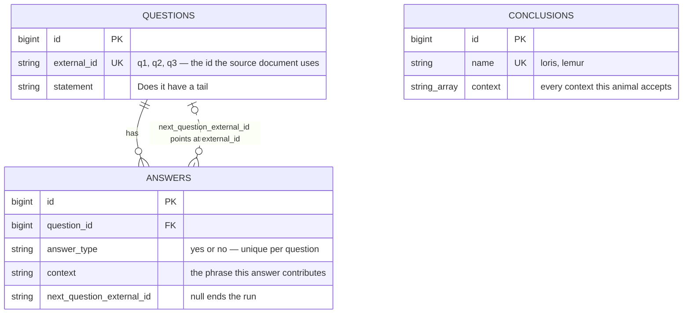

# Animal Identifier

Answer a short run of yes/no questions and this Rails app names the animal — or
says plainly that the questionnaire has no answer for the route you took. The
questions, the branches between them and the animals they lead to all live in
`data.json`. Nothing under `app/` knows what a tail is.

> The repository is named after the exercise rather than the software. What is
> actually here is a decision-tree questionnaire engine: a JSON document
> imported into PostgreSQL, a graph walked one question at a time, and a scorer
> that decides which conclusion the collected answers point at.

## What a run looks like

| Start | Mid-questionnaire |
| --- | --- |
|  |  |

| A conclusion | No conclusion |
| --- | --- |
|  |  |

## Every route, and where it lands

The supplied questionnaire has three questions and two animals, which gives six
routes from the first question to a terminal answer. `bin/rails quiz:paths`
walks all of them (output kept in [`docs/quiz-paths.txt`](docs/quiz-paths.txt)):

```
tail + long tail (> 2in) + nocturnal             -> inconclusive (closest: lemur)
tail + long tail (> 2in) + diurnal               -> lemur
tail + short tail (< 2in) + nocturnal            -> loris
tail + short tail (< 2in) + diurnal              -> inconclusive (closest: lemur)
no tail + nocturnal                              -> loris
no tail + diurnal                                -> inconclusive (closest: lemur)
```

Half of the routes match nothing. That is a property of the data the exercise
supplies, not a defect, and the application is built to report it rather than
round to the nearest animal.

## How a conclusion is chosen

Each answer contributes a **context** — a short phrase such as `no tail` or
`nocturnal`. Each conclusion carries the set of contexts it *accepts*; `loris`
accepts both `tail` and `no tail`, because lorises come both ways.

A conclusion is an exact match when every context the visitor produced is one it
accepts. The reverse is not required: the visitor need not have produced every
context the conclusion accepts. Three questions yield two or three contexts per
run, while `loris` accepts four, so demanding a full set would match nothing.

When nothing matches exactly, `Quiz::ConclusionMatcher` still ranks the
candidates and the result page shows the closest one, its score, and the
contexts it could not explain. Ranking is deterministic: highest score first,
then the more specific conclusion (the one accepting fewest contexts), then
name. The `50% / 50%` tie in the fourth screenshot is broken by that middle
rule — `lemur` accepts three contexts, `loris` four.

`app/services/quiz/conclusion_matcher.rb` is plain Ruby over three fields and is
tested against the complete truth table above, not a hand-picked path.

## The questionnaire is data

`data.json` is read by `Quiz::Sources::JsonFile`, turned into plain hashes, and
written into PostgreSQL by `Quiz::Importer`. Importing is a deploy-time step
(`bin/rails quiz:import`, also run by `db/seeds.rb`), idempotent, and wrapped in
one transaction: editing the source updates rows in place, entries that have
gone away are pruned, and a questionnaire whose answers point at questions that
do not exist is rejected whole rather than half-applied.



Two things in that diagram are deliberate. The branch pointer is a *soft* link:
answers store the source document's own `external_id`, so an import can write
questions in any order and `Quiz::Graph` resolves the hops in memory after one
round trip. And `conclusions` has no foreign key to anything — a conclusion is
matched by its contexts, never by its position in the tree, which is why adding
an animal needs no schema change.

Swapping the source entirely is the other extension seam. `Quiz::Sources` is a
registry of adapters; a source is any object answering `#questions` and
`#conclusions`. Register a builder and point `QUESTIONNAIRE_SOURCE` at it to
load from an HTTP API or a CMS without touching the importer, the matcher or the
controller.

## Running it

Ruby 3.1 (`.ruby-version` pins 3.1.3), Node with Yarn, and a reachable
PostgreSQL.

```bash
bundle install
yarn install
bin/rails db:prepare     # create + migrate; seeds run the import
bin/rails quiz:import    # idempotent, safe to re-run
bin/dev                  # Rails, esbuild --watch and tailwind --watch
```

Then open <http://localhost:3000>.

A multi-stage `Dockerfile` and a `docker-compose.yml` (Postgres 16, web on host
port 8661, database on 8662) are included; the entrypoint runs `db:prepare` and
`quiz:import` on start, and `HEALTHCHECK` hits `/up`. **Neither the image build
nor a container boot has been run in this environment**, so treat the stack as
authored and unverified.

## Settings

| Variable | Default | Purpose |
| --- | --- | --- |
| `DATABASE_URL` | — | Full connection string. Overrides everything below. |
| `DATABASE_NAME` | `doma_test_development` / `doma_test_production` | Database for the current environment. |
| `TEST_DATABASE_NAME` | `doma_test_test` | Database used by `bin/rails test`. |
| `DATABASE_HOST` / `DATABASE_PORT` | local socket / `5432` | Where PostgreSQL is. |
| `DATABASE_USERNAME` / `DATABASE_PASSWORD` | OS user / — | Role to connect as. |
| `RAILS_MAX_THREADS` | `5` | Puma threads and the Active Record pool size. |
| `SECRET_KEY_BASE` | — | Required in production. `bin/rails secret` generates one. |
| `QUESTIONNAIRE_SOURCE` | `json_file` | Which registered adapter to import from. |
| `QUESTIONNAIRE_PATH` | `data.json` | What to hand that adapter. |
| `SKIP_DB_PREPARE` | unset | Set to `1` to stop the container entrypoint migrating and importing. |

`.env.example` is the tracked template; no credentials are committed.

## Tests and checks

```bash
bin/rails test           # 69 runs, 181 assertions, 0 failures, 0 errors, 0 skips
bundle exec rubocop      # rubocop-rails-omakase: 54 files, no offenses
bin/rails quiz:paths     # the truth table above
```

The suite imports the real `data.json` rather than fixtures, so a change to the
questionnaire that breaks the application breaks the build. A transcript of a
run is in [`docs/test-run.txt`](docs/test-run.txt).

One test is worth pointing at: `test/integration/quiz_flow_test.rb` asserts that
rendering a question issues exactly **two** queries — one for the questions, one
for their answers, both preloaded by `Quiz::Graph` — so per-row querying cannot
creep back in unnoticed.

## Reading the code

The controller only routes. Everything that decides anything is in
`app/services/quiz/`:

| File | Responsibility |
| --- | --- |
| `sources.rb` | Adapter registry — the extension seam |
| `sources/json_file.rb` | Reads and validates the JSON document |
| `importer.rb` | Transactional, idempotent import and reconciliation |
| `graph.rb` | Traversal: root, depth, every route, cycle detection |
| `conclusion_matcher.rb` | Scoring and ranking — the domain rule |
| `progress.rb` | One visitor's run, backed by the session |

`Quiz::Progress` keeps JSON-safe hashes because the session is serialised as
JSON, and truncates forward history when a visitor re-answers an earlier
question: in a decision tree, the answers after the one you changed are no
longer reachable.

## Out of scope

- One imported questionnaire at a time — no multi-tenancy, no versioning.
- Progress lives in the session cookie, so a run cannot be resumed on another
  device and does not survive clearing cookies.
- Questionnaire text comes from the source document as written. UI chrome is in
  `config/locales/en.yml`, but there is no translation layer for the questions
  themselves.
- Contexts are opaque strings. The matcher has no notion of one context
  contradicting another beyond "this conclusion does not accept it".
- No authentication, rate limiting or analytics — none were asked for.
