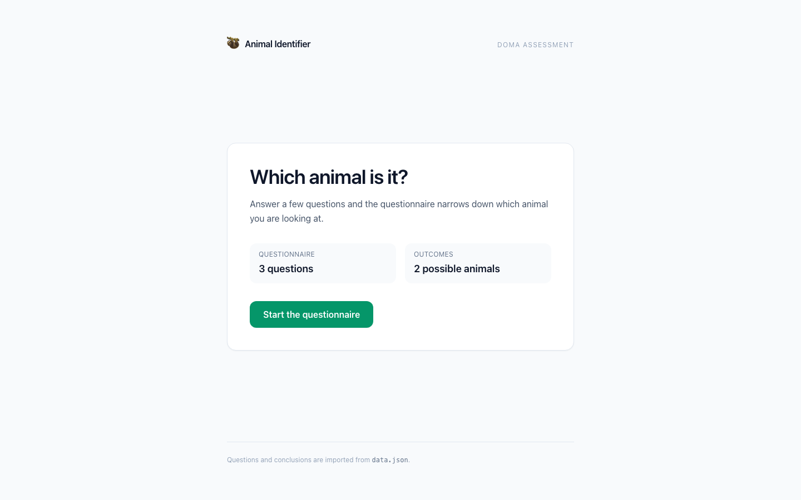
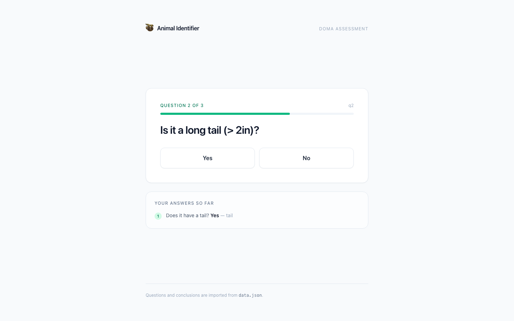
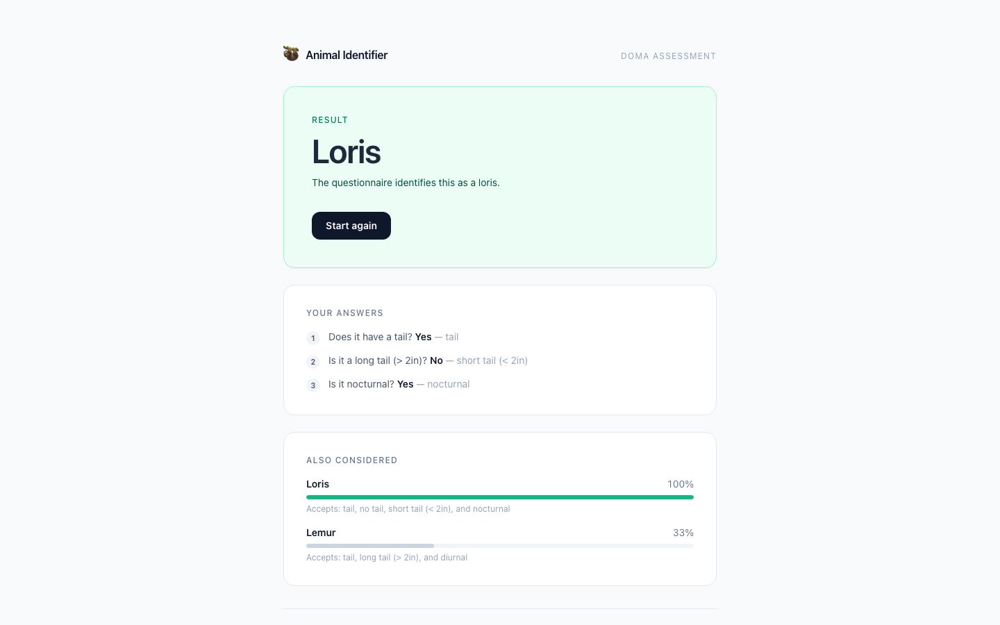
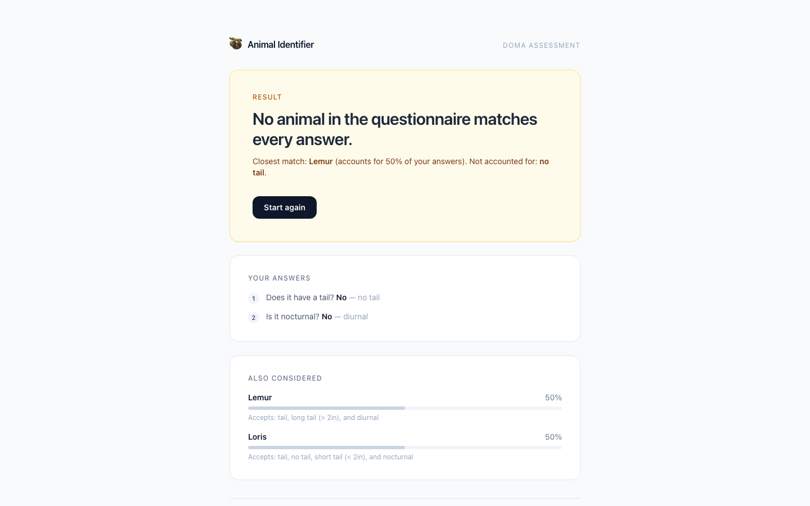
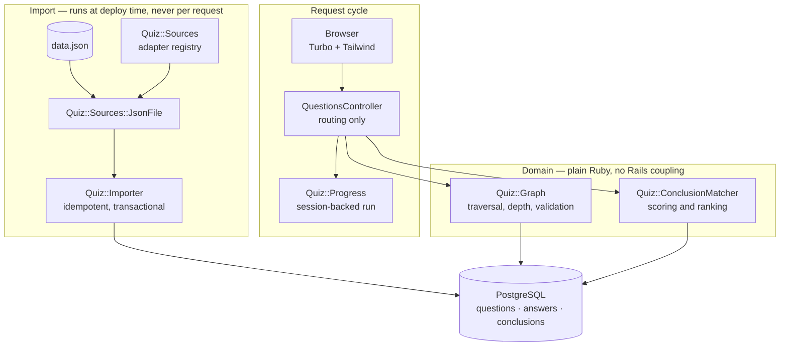
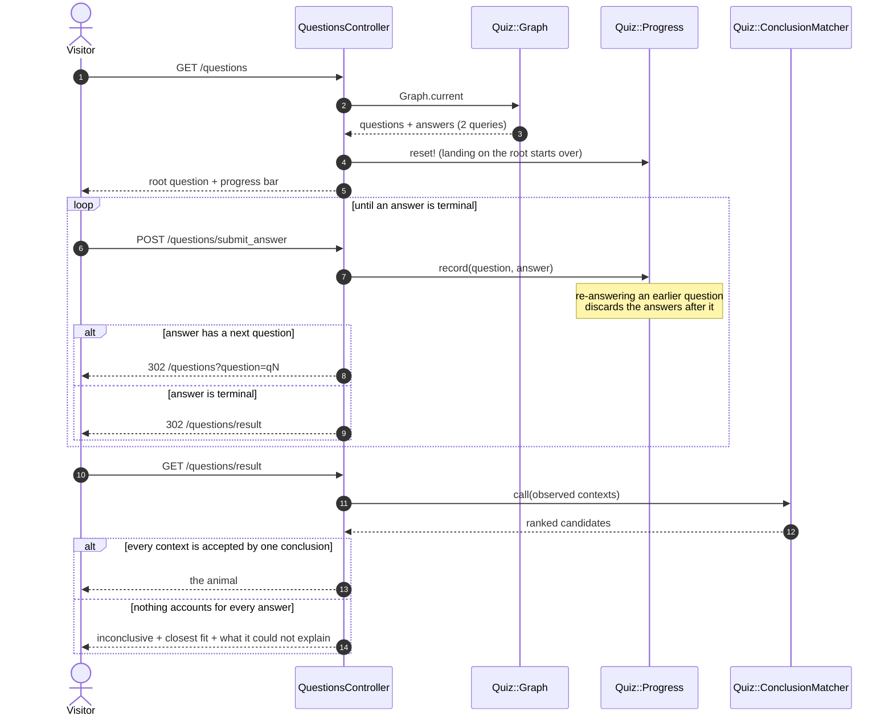

# Animal Identifier — DOMA assessment

A small Rails application that walks a visitor through a decision tree of
yes/no questions and names the animal the answers point at. The questionnaire
itself is data, not code: questions, the routes between them and the
conclusions they lead to are all read from `data.json` and imported into
PostgreSQL.

Where no conclusion accounts for every answer the app says so and shows the
closest fit, rather than guessing — three of the six routes through the
supplied questionnaire genuinely have no answer in it.

## Screenshots

| Start | Mid-questionnaire |
| --- | --- |
|  |  |

| Conclusive result | Inconclusive result |
| --- | --- |
|  |  |

Every route through the shipped questionnaire, printed by `bin/rails quiz:paths`
(captured in [`docs/quiz-paths.txt`](docs/quiz-paths.txt)):

```
tail + long tail (> 2in) + nocturnal             -> inconclusive (closest: lemur)
tail + long tail (> 2in) + diurnal               -> lemur
tail + short tail (< 2in) + nocturnal            -> loris
tail + short tail (< 2in) + diurnal              -> inconclusive (closest: lemur)
no tail + nocturnal                              -> loris
no tail + diurnal                                -> inconclusive (closest: lemur)
```

## Architecture



## How a run works



## Quickstart

Requires Ruby 3.1, Node 18+, Yarn and a reachable PostgreSQL.

```bash
bundle install
yarn install
bin/rails db:prepare     # create + migrate; seeds run the import
bin/rails quiz:import    # idempotent, safe to re-run
bin/dev                  # http://localhost:3000
```

With Docker instead (the image builds assets and prepares the database on start):

```bash
docker compose up --build   # http://localhost:8661
```

## Configuration

| Variable | Required | Default | Purpose |
| --- | --- | --- | --- |
| `DATABASE_URL` | no | — | Full connection string. Overrides everything below when set. |
| `DATABASE_NAME` | no | `doma_test_development` / `doma_test_production` | Database name for the current environment. |
| `TEST_DATABASE_NAME` | no | `doma_test_test` | Database used by `bin/rails test`. |
| `DATABASE_HOST` | no | local socket | PostgreSQL host. |
| `DATABASE_PORT` | no | `5432` | PostgreSQL port. |
| `DATABASE_USERNAME` | no | OS user | PostgreSQL role. |
| `DATABASE_PASSWORD` | no | — | Password for that role. |
| `RAILS_MAX_THREADS` | no | `5` | Puma threads and the Active Record pool size. |
| `SECRET_KEY_BASE` | production | — | Session cookie signing key. `bin/rails secret` generates one. |
| `QUESTIONNAIRE_SOURCE` | no | `json_file` | Which registered source adapter to import from. |
| `QUESTIONNAIRE_PATH` | no | `data.json` | What to hand that adapter. |
| `RAILS_SERVE_STATIC_FILES` | no | unset | Serve precompiled assets from Puma. Set in the image. |
| `SKIP_DB_PREPARE` | no | unset | Set to `1` to stop the container entrypoint migrating and importing. |

`.env.example` lists the same set as a starting point.

## Development

```bash
bin/dev                  # Rails, esbuild --watch and tailwind --watch together
bin/rails test           # the whole suite
bin/rails test test/services/quiz/conclusion_matcher_test.rb
bundle exec rubocop      # rubocop-rails-omakase, zero offences
bin/rails quiz:paths     # print every route and the conclusion it reaches
```

The suite runs against the real `data.json`, so a change to the questionnaire
that breaks the application breaks the build.

## Project structure

```
app/
  controllers/
    questions_controller.rb   # routing and redirects only
    health_controller.rb      # /up, used by the container healthcheck
  models/                     # Question, Answer, Conclusion — validations and
                              # associations, no matching logic
  services/quiz/
    sources.rb                # adapter registry (the extension seam)
    sources/json_file.rb      # reads and validates data.json
    importer.rb              # idempotent, transactional import + reconciliation
    graph.rb                  # traversal: root, depth, every route, cycle check
    conclusion_matcher.rb     # scoring and ranking — the domain rule
    progress.rb               # one visitor's run, backed by the session
  views/                      # Tailwind, server rendered
config/
  initializers/quiz.rb        # registers the json_file adapter
db/migrate/                   # three original tables + one clarifying migration
docs/screenshots/             # the images above
lib/tasks/quiz.rake           # quiz:import, quiz:paths
test/                         # models, services, integration
data.json                     # the questionnaire
```

## Design notes

**The questionnaire is data.** Nothing in `app/` knows about tails or lemurs.
Swapping `data.json` for a different decision tree needs no code change, and
the import validates the graph before committing: a questionnaire whose answers
point at questions that do not exist is rejected as a whole rather than
half-imported.

**Matching is a domain rule, not controller code.** A conclusion carries the
set of contexts it *accepts* — "loris" accepts both `tail` and `no tail`,
because lorises come both ways — so a conclusion matches when every context the
visitor produced is one it accepts. It does not have to use all of them. Ties
break toward the more specific conclusion (the one accepting fewest contexts),
then by name, so the result is deterministic. `Quiz::ConclusionMatcher` is plain
Ruby over three fields and is tested against the complete truth table for the
shipped questionnaire.

**Saying "I don't know" is a feature.** Three of six routes through `data.json`
match no conclusion at all. Returning the closest candidate with the score and
the contexts it could not explain is more useful, and more honest, than naming
an animal the data does not support.

**Import is a deploy-time concern.** It used to run as a `before_action` on
every question page: a file read, a JSON parse, and one `SELECT` per question
and per conclusion before anything was rendered. Rendering a question now costs
two queries — one for questions, one for their answers, both preloaded by
`Quiz::Graph` — and an integration test asserts that number so the regression
cannot come back quietly.

**Indexes match the access patterns.** Every lookup is by `questions.external_id`
or `(answers.question_id, answers.answer_type)`; both are unique indexes, which
also enforce the invariants the importer depends on. `conclusions.name` is
unique for the same reason.

**The front end is server rendered on purpose.** A three-question form does not
need a client-side router. Removing the unused React and `react-router-dom`
scaffolding — four components, one of which rendered an empty fragment — took
the JavaScript bundle from 1,350,894 bytes to 232,067, a measured 83% cut, with
no change in behaviour. Turbo handles navigation; Stimulus is left wired up for
when a control needs it.

**Session state is a small object.** `Quiz::Progress` owns the run, stores
JSON-safe hashes because the session is serialised as JSON, and truncates
forward history when a visitor re-answers an earlier question — in a decision
tree, the answers after the one you changed are no longer reachable.

**Extending it.** `Quiz::Sources` is a registry: register a builder under a name
and point `QUESTIONNAIRE_SOURCE` at it to load the questionnaire from an HTTP
API, a CMS or a directory of YAML, without touching the importer, the matcher
or the controller. A source is any object answering `#questions` and
`#conclusions`; the importer's tests drive it with a five-line `Struct`.

## Limitations

- Single-tenant and single-questionnaire: one imported tree at a time.
- Progress lives in the session cookie, so a run does not survive clearing
  cookies and cannot be resumed on another device.
- Answer labels come from the source document and are shown humanised. There is
  no translation layer for a questionnaire written in another language.
- The matcher treats contexts as opaque strings; it has no notion of a context
  contradicting another beyond "this conclusion does not accept it".
- No authentication, rate limiting or analytics — none were asked for.
- `docker build` and `docker compose up` are authored but unverified here; see
  the note in the accompanying report.
